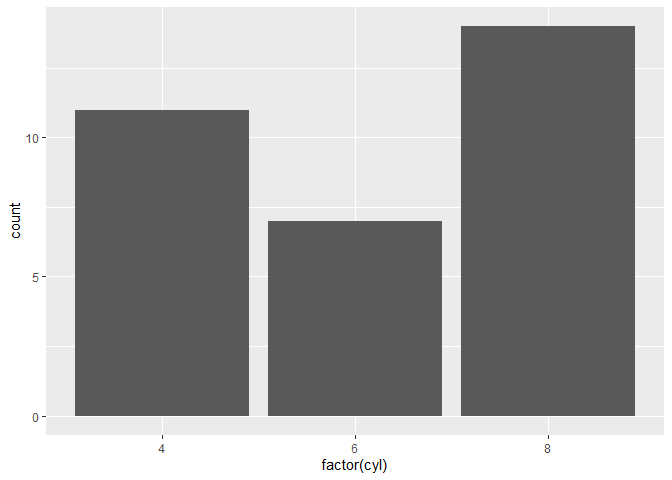

# This is my first markdown file

```r
4*12
```

```
## [1] 48
```

## This is my [email](mailto:brezende@ucdavis.edu)

### This is [Google](https://www.google.com) 

## Problem 1
# Brian and his friends go out to dinner. Dinner costs $978.56. There are 14 people at dinner. How much does everyone pay?

```r
978.56/14
```

```
## [1] 69.89714
```

```r
#install.packages("tidyverse")
library("tidyverse")
```

```r
ggplot(mtcars, aes(x = factor(cyl))) +
    geom_bar()
```

<!-- -->
