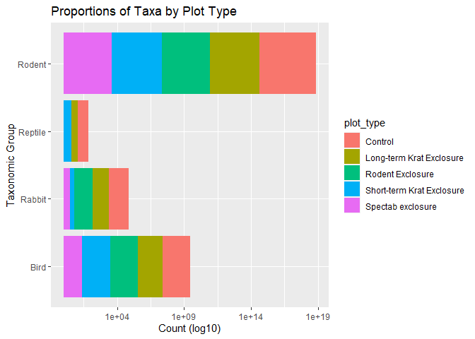
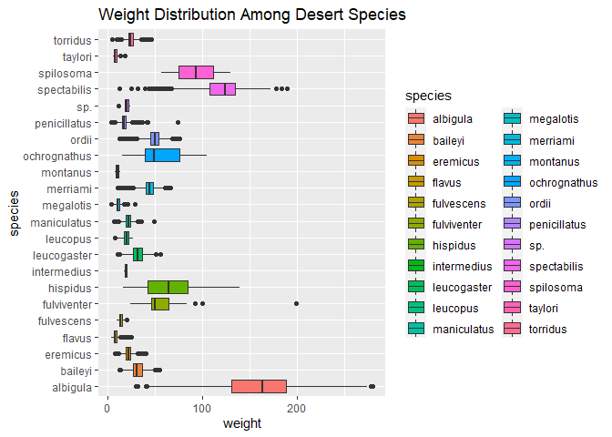
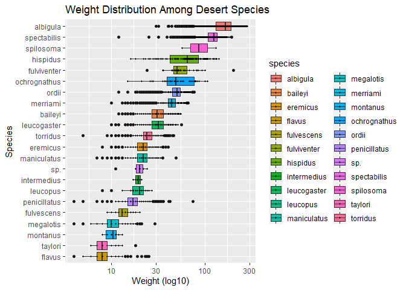
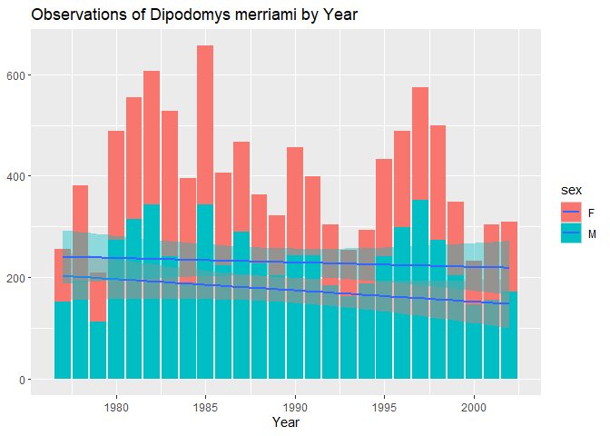

## Instructions
Answer the following questions and complete the exercises in RMarkdown. Please embed all of your code and push your final work to your repository. Your final lab report should be organized, clean, and run free from errors. Remember, you must remove the `#` for the included code chunks to run. Be sure to add your name to the author header above. For any included plots, make sure they are clearly labeled. You are free to use any plot type that you feel best communicates the results of your analysis.  

Make sure to use the formatting conventions of RMarkdown to make your report neat and clean!  

## Load the libraries

```r
library(tidyverse)
library(janitor)
library(here)
library(naniar)
```

## Desert Ecology
For this assignment, we are going to use a modified data set on [desert ecology](http://esapubs.org/archive/ecol/E090/118/). The data are from: S. K. Morgan Ernest, Thomas J. Valone, and James H. Brown. 2009. Long-term monitoring and experimental manipulation of a Chihuahuan Desert ecosystem near Portal, Arizona, USA. Ecology 90:1708.

```r
deserts <- read_csv(here("lab10", "data", "surveys_complete.csv"))
```

```
## 
## -- Column specification --------------------------------------------------------
## cols(
##   record_id = col_double(),
##   month = col_double(),
##   day = col_double(),
##   year = col_double(),
##   plot_id = col_double(),
##   species_id = col_character(),
##   sex = col_character(),
##   hindfoot_length = col_double(),
##   weight = col_double(),
##   genus = col_character(),
##   species = col_character(),
##   taxa = col_character(),
##   plot_type = col_character()
## )
```

1. Use the function(s) of your choice to get an idea of its structure, including how NA's are treated. Are the data tidy? 

```r
glimpse(deserts)
```

```
## Rows: 34,786
## Columns: 13
## $ record_id       <dbl> 1, 2, 3, 4, 5, 6, 7, 8, 9, 10, 11, 12, 13, 14, 15, ...
## $ month           <dbl> 7, 7, 7, 7, 7, 7, 7, 7, 7, 7, 7, 7, 7, 7, 7, 7, 7, ...
## $ day             <dbl> 16, 16, 16, 16, 16, 16, 16, 16, 16, 16, 16, 16, 16,...
## $ year            <dbl> 1977, 1977, 1977, 1977, 1977, 1977, 1977, 1977, 197...
## $ plot_id         <dbl> 2, 3, 2, 7, 3, 1, 2, 1, 1, 6, 5, 7, 3, 8, 6, 4, 3, ...
## $ species_id      <chr> "NL", "NL", "DM", "DM", "DM", "PF", "PE", "DM", "DM...
## $ sex             <chr> "M", "M", "F", "M", "M", "M", "F", "M", "F", "F", "...
## $ hindfoot_length <dbl> 32, 33, 37, 36, 35, 14, NA, 37, 34, 20, 53, 38, 35,...
## $ weight          <dbl> NA, NA, NA, NA, NA, NA, NA, NA, NA, NA, NA, NA, NA,...
## $ genus           <chr> "Neotoma", "Neotoma", "Dipodomys", "Dipodomys", "Di...
## $ species         <chr> "albigula", "albigula", "merriami", "merriami", "me...
## $ taxa            <chr> "Rodent", "Rodent", "Rodent", "Rodent", "Rodent", "...
## $ plot_type       <chr> "Control", "Long-term Krat Exclosure", "Control", "...
```

```r
deserts %>% 
  skimr::skim()
```


Table: Data summary

|                         |           |
|:------------------------|:----------|
|Name                     |Piped data |
|Number of rows           |34786      |
|Number of columns        |13         |
|_______________________  |           |
|Column type frequency:   |           |
|character                |6          |
|numeric                  |7          |
|________________________ |           |
|Group variables          |None       |


**Variable type: character**

|skim_variable | n_missing| complete_rate| min| max| empty| n_unique| whitespace|
|:-------------|---------:|-------------:|---:|---:|-----:|--------:|----------:|
|species_id    |         0|          1.00|   2|   2|     0|       48|          0|
|sex           |      1748|          0.95|   1|   1|     0|        2|          0|
|genus         |         0|          1.00|   6|  16|     0|       26|          0|
|species       |         0|          1.00|   3|  15|     0|       40|          0|
|taxa          |         0|          1.00|   4|   7|     0|        4|          0|
|plot_type     |         0|          1.00|   7|  25|     0|        5|          0|


**Variable type: numeric**

|skim_variable   | n_missing| complete_rate|     mean|       sd|   p0|     p25|     p50|      p75|  p100|hist                                     |
|:---------------|---------:|-------------:|--------:|--------:|----:|-------:|-------:|--------:|-----:|:----------------------------------------|
|record_id       |         0|          1.00| 17804.20| 10229.68|    1| 8964.25| 17761.5| 26654.75| 35548|▇▇▇▇▇ |
|month           |         0|          1.00|     6.47|     3.40|    1|    4.00|     6.0|    10.00|    12|▇▆▆▅▇ |
|day             |         0|          1.00|    16.10|     8.25|    1|    9.00|    16.0|    23.00|    31|▆▇▇▇▆ |
|year            |         0|          1.00|  1990.50|     7.47| 1977| 1984.00|  1990.0|  1997.00|  2002|▇▆▇▇▇ |
|plot_id         |         0|          1.00|    11.34|     6.79|    1|    5.00|    11.0|    17.00|    24|▇▆▇▆▅ |
|hindfoot_length |      3348|          0.90|    29.29|     9.56|    2|   21.00|    32.0|    36.00|    70|▁▇▇▁▁ |
|weight          |      2503|          0.93|    42.67|    36.63|    4|   20.00|    37.0|    48.00|   280|▇▁▁▁▁ |

```r
naniar::miss_var_summary(deserts)
```

```
## # A tibble: 13 x 3
##    variable        n_miss pct_miss
##    <chr>            <int>    <dbl>
##  1 hindfoot_length   3348     9.62
##  2 weight            2503     7.20
##  3 sex               1748     5.03
##  4 record_id            0     0   
##  5 month                0     0   
##  6 day                  0     0   
##  7 year                 0     0   
##  8 plot_id              0     0   
##  9 species_id           0     0   
## 10 genus                0     0   
## 11 species              0     0   
## 12 taxa                 0     0   
## 13 plot_type            0     0
```

The data is not tidy, as many of the column names contain variables that could be used for further exploratory analysis. Variables such as month, day, and weight could be used in a cleaner fashion in order to make the data tidy. Moreover, NA's in this dataset are represented as NA's and do not appear as "-999" or anything else. 

2. How many genera and species are represented in the data? What are the total number of observations? Which species is most/ least frequently sampled in the study?

```r
deserts %>% 
  count(genus, species) %>% 
  arrange(desc(n))
```

```
## # A tibble: 48 x 3
##    genus           species          n
##    <chr>           <chr>        <int>
##  1 Dipodomys       merriami     10596
##  2 Chaetodipus     penicillatus  3123
##  3 Dipodomys       ordii         3027
##  4 Chaetodipus     baileyi       2891
##  5 Reithrodontomys megalotis     2609
##  6 Dipodomys       spectabilis   2504
##  7 Onychomys       torridus      2249
##  8 Perognathus     flavus        1597
##  9 Peromyscus      eremicus      1299
## 10 Neotoma         albigula      1252
## # ... with 38 more rows
```

```r
deserts %>% 
  select(genus, species) %>% 
  summarize(total=n())
```

```
## # A tibble: 1 x 1
##   total
##   <int>
## 1 34786
```

```r
deserts %>% 
  count(species, sort = T) %>% 
  top_n(2,n)
```

```
## # A tibble: 2 x 2
##   species          n
##   <chr>        <int>
## 1 merriami     10596
## 2 penicillatus  3123
```

```r
deserts %>% 
  count(species, sort = T) %>% 
  top_n(-6,n)
```

```
## # A tibble: 6 x 2
##   species          n
##   <chr>        <int>
## 1 clarki           1
## 2 scutalatus       1
## 3 tereticaudus     1
## 4 tigris           1
## 5 uniparens        1
## 6 viridis          1
```

The most sampled species in this study is **merriami** and the least frequently sampled species is **clarki, scutalatus, tereticaudus, tigris, uniparens, and viridis.** 

3. What is the proportion of taxa included in this study? Show a table and plot that reflects this count.

```r
deserts %>% 
  count(taxa) %>% 
  arrange(desc(n))
```

```
## # A tibble: 4 x 2
##   taxa        n
##   <chr>   <int>
## 1 Rodent  34247
## 2 Bird      450
## 3 Rabbit     75
## 4 Reptile    14
```

```r
deserts %>% 
  ggplot(aes(x=taxa))+geom_bar()+scale_y_log10()+coord_flip()+
  labs(title = "Scaled Proportion of Taxa in Desert Data",
       x = "Taxa")
```

<!-- -->

4. For the taxa included in the study, use the fill option to show the proportion of individuals sampled by `plot_type.`

```r
deserts %>% 
  ggplot(aes(x=taxa, fill=plot_type))+geom_bar()+scale_y_log10()+
  coord_flip()+
  labs(titles = "Proportions of Taxa by Plot Type",
       x = "Taxonomic Group",
       y = "Count (log10)", 
       fill = "plot_type")
```

<!-- -->

5. What is the range of weight for each species included in the study? Remove any observations of weight that are NA so they do not show up in the plot.

```r
deserts %>% 
  filter(weight!="NA") %>% 
  ggplot(aes(x=species, y=weight, fill=species))+ geom_boxplot()+
  coord_flip()+
  labs(title = "Weight Distribution Among Desert Species")
```

<!-- -->

6. Add another layer to your answer from #5 using `geom_point` to get an idea of how many measurements were taken for each species.

```r
deserts %>% 
  filter(weight!="NA") %>% 
  ggplot(aes(x=reorder(species, weight), y= weight, fill=species))+
  geom_boxplot()+
  geom_point(size = 0.75)+
  scale_y_log10()+
  coord_flip()+
  labs(titles = "Weight Distribution Among Desert Species",
       x = "Species",
       y = "Weight (log10)",
       fill = "species")
```

<!-- -->


7. [Dipodomys merriami](https://en.wikipedia.org/wiki/Merriam's_kangaroo_rat) is the most frequently sampled animal in the study. How have the number of observations of this species changed over the years included in the study?

```r
deserts %>% 
  filter(species=="merriami") %>% 
  filter(sex!="NA") %>% 
  group_by(year, sex) %>% 
  summarize(observations = n()) %>% 
  ggplot(aes(x= year, y = observations, fill = sex))+
  geom_col()+
  geom_smooth(method = "lm")+
  labs(title = "Observations of Dipodomys merriami by Year",
       x = "Year",
       y = NULL) 
```

```
## `summarise()` regrouping output by 'year' (override with `.groups` argument)
```

```
## `geom_smooth()` using formula 'y ~ x'
```

<!-- -->

8. What is the relationship between `weight` and `hindfoot` length? Consider whether or not over plotting is an issue.

```r
deserts %>% 
  filter(weight!="NA", hindfoot_length!="NA") %>% 
  ggplot(aes(x=weight, y=hindfoot_length))+
  geom_point(size=0.25, na.rm = T)+
  geom_smooth(method = "lm")+
  labs(title = "Relationship Between Species Weight & Hindfoot Length")
```

```
## `geom_smooth()` using formula 'y ~ x'
```

<!-- -->
The relationship between these two variables is incredibly difficult to decipher. Despite adjusting the point size and filtering of NAs, it is apparent that over plotting is an issue between these two issues. The general trend that this is demonstrating is a positive relationship between weight and hindfoot length. 

9. Which two species have, on average, the highest weight? Once you have identified them, make a new column that is a ratio of `weight` to `hindfoot_length`. Make a plot that shows the range of this new ratio and fill by sex.

```r
deserts %>% 
  filter(weight!="NA") %>% 
  group_by(species) %>% 
  summarize(avg_weight = mean(weight, na.rm = T),
            .groups = 'keep') %>% 
  arrange(desc(avg_weight)) %>% 
  top_n(2, avg_weight)
```

```
## # A tibble: 22 x 2
## # Groups:   species [22]
##    species      avg_weight
##    <chr>             <dbl>
##  1 albigula          159. 
##  2 spectabilis       120. 
##  3 spilosoma          93.5
##  4 hispidus           65.6
##  5 fulviventer        58.9
##  6 ochrognathus       55.4
##  7 ordii              48.9
##  8 merriami           43.2
##  9 baileyi            31.7
## 10 leucogaster        31.6
## # ... with 12 more rows
```

```r
whl <- deserts %>% 
  filter(weight!="NA", hindfoot_length!="NA", sex!="NA") %>% 
  filter(species=="albigula"|species=="spectabilis") %>% 
  mutate(weight_to_hindfoot = weight/hindfoot_length) %>% 
  select(hindfoot_length, weight, species, sex, weight_to_hindfoot)
whl
```

```
## # A tibble: 3,068 x 5
##    hindfoot_length weight species     sex   weight_to_hindfoot
##              <dbl>  <dbl> <chr>       <chr>              <dbl>
##  1              50    117 spectabilis F                   2.34
##  2              51    121 spectabilis F                   2.37
##  3              51    115 spectabilis M                   2.25
##  4              48    120 spectabilis F                   2.5 
##  5              48    118 spectabilis F                   2.46
##  6              52    126 spectabilis F                   2.42
##  7              50    132 spectabilis M                   2.64
##  8              53    122 spectabilis F                   2.30
##  9              48    107 spectabilis F                   2.23
## 10              50    115 spectabilis F                   2.3 
## # ... with 3,058 more rows
```

```r
whl %>% 
  ggplot(aes(x=species, y=weight_to_hindfoot, fill = sex))+ geom_boxplot(na.rm = T)+
  labs(title = "Weight To Hindfoot Length Ratio of Heaviest Species",
       x = "Species",
       y = "Weight/Hindfoot Length")
```

<!-- -->


10. Make one plot of your choice! Make sure to include at least two of the aesthetics options you have learned.


```r
deserts %>% 
  filter(taxa=="Bird") %>% 
  group_by(year, species) %>% 
  summarize(observations = n(),
            .groups = 'keep') %>% 
  ggplot(aes(x=year, y=observations, fill = species))+
  geom_col()+
  coord_flip()+
  labs(title = "Total Observation of Bird Species by Year",
       x = "Year",
       y = "n" )+
  theme(plot.title = element_text(size = rel(1), hjust = 0.5))
```

<!-- -->

## Push your final code to GitHub!
Please be sure that you check the `keep md` file in the knit preferences. 
