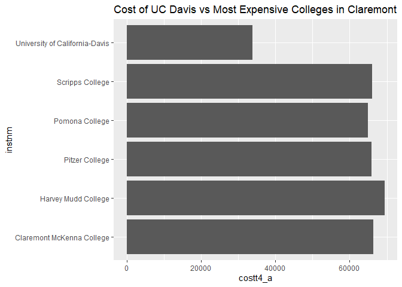
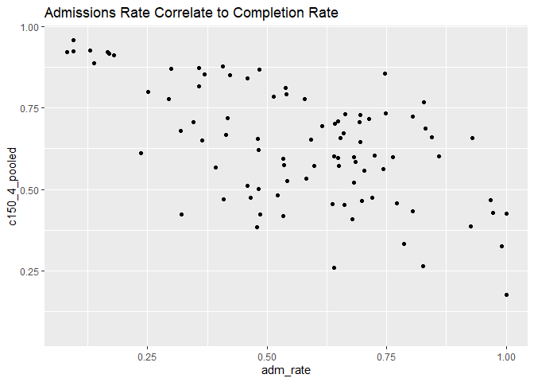
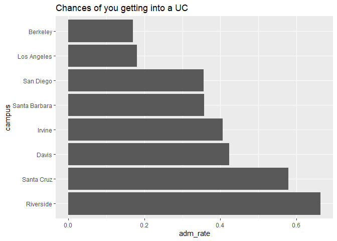
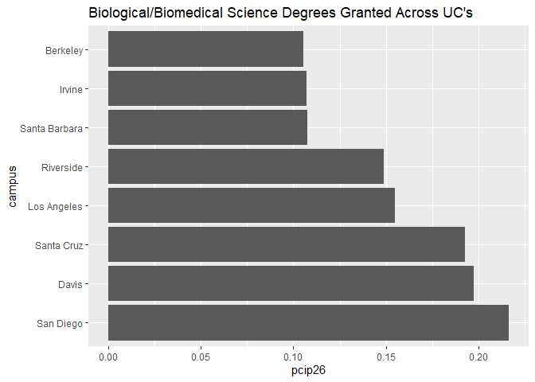

## Instructions
Answer the following questions and complete the exercises in RMarkdown. Please embed all of your code and push your final work to your repository. Your final lab report should be organized, clean, and run free from errors. Remember, you must remove the `#` for the included code chunks to run. Be sure to add your name to the author header above.  

Make sure to use the formatting conventions of RMarkdown to make your report neat and clean!  

## Load the libraries

```r
library(tidyverse)
library(janitor)
library(here)
library(naniar)
```

For this homework, we will take a departure from biological data and use data about California colleges. These data are a subset of the national college scorecard (https://collegescorecard.ed.gov/data/). Load the `ca_college_data.csv` as a new object called `colleges`.

```r
colleges <- read.csv("data/ca_college_data.csv")
```

The variables are a bit hard to decipher, here is a key:  

INSTNM: Institution name  
CITY: California city  
STABBR: Location state  
ZIP: Zip code  
ADM_RATE: Admission rate  
SAT_AVG: SAT average score  
PCIP26: Percentage of degrees awarded in Biological And Biomedical Sciences  
COSTT4_A: Annual cost of attendance  
C150_4_POOLED: 4-year completion rate  
PFTFTUG1_EF: Percentage of undergraduate students who are first-time, full-time degree/certificate-seeking undergraduate students  

1. Use your preferred function(s) to have a look at the data and get an idea of its structure. Make sure you summarize NA's and determine whether or not the data are tidy. You may also consider dealing with any naming issues.

```r
colleges <- janitor::clean_names(colleges)
glimpse(colleges)
```

```
## Rows: 341
## Columns: 10
## $ instnm        <chr> "Grossmont College", "College of the Sequoias", "Coll...
## $ city          <chr> "El Cajon", "Visalia", "San Mateo", "Ventura", "Oxnar...
## $ stabbr        <chr> "CA", "CA", "CA", "CA", "CA", "CA", "CA", "CA", "CA",...
## $ zip           <chr> "92020-1799", "93277-2214", "94402-3784", "93003-3872...
## $ adm_rate      <dbl> NA, NA, NA, NA, NA, NA, NA, NA, NA, NA, NA, NA, NA, N...
## $ sat_avg       <int> NA, NA, NA, NA, NA, NA, NA, NA, NA, NA, NA, NA, NA, N...
## $ pcip26        <dbl> 0.0016, 0.0066, 0.0038, 0.0035, 0.0085, 0.0151, 0.000...
## $ costt4_a      <int> 7956, 8109, 8278, 8407, 8516, 8577, 8580, 9181, 9281,...
## $ c150_4_pooled <dbl> NA, NA, NA, NA, NA, NA, 0.2334, NA, NA, NA, NA, 0.170...
## $ pftftug1_ef   <dbl> 0.3546, 0.5413, 0.3567, 0.3824, 0.2753, 0.4286, 0.230...
```


```r
colleges %>% 
  skimr::skim()
```


Table: Data summary

|                         |           |
|:------------------------|:----------|
|Name                     |Piped data |
|Number of rows           |341        |
|Number of columns        |10         |
|_______________________  |           |
|Column type frequency:   |           |
|character                |4          |
|numeric                  |6          |
|________________________ |           |
|Group variables          |None       |


**Variable type: character**

|skim_variable | n_missing| complete_rate| min| max| empty| n_unique| whitespace|
|:-------------|---------:|-------------:|---:|---:|-----:|--------:|----------:|
|instnm        |         0|             1|  10|  63|     0|      341|          0|
|city          |         0|             1|   4|  19|     0|      161|          0|
|stabbr        |         0|             1|   2|   2|     0|        3|          0|
|zip           |         0|             1|   5|  10|     0|      324|          0|


**Variable type: numeric**

|skim_variable | n_missing| complete_rate|     mean|       sd|      p0|      p25|      p50|      p75|     p100|hist  |
|:-------------|---------:|-------------:|--------:|--------:|-------:|--------:|--------:|--------:|--------:|:-----|
|adm_rate      |       240|          0.30|     0.59|     0.23|    0.08|     0.46|     0.64|     0.75|     1.00|▂▃▆▇▃ |
|sat_avg       |       276|          0.19|  1112.31|   170.80|  870.00|   985.00|  1078.00|  1237.00|  1555.00|▇▇▅▂▂ |
|pcip26        |        35|          0.90|     0.02|     0.04|    0.00|     0.00|     0.00|     0.02|     0.22|▇▁▁▁▁ |
|costt4_a      |       124|          0.64| 26685.17| 18122.70| 7956.00| 12578.00| 16591.00| 39289.00| 69355.00|▇▂▂▁▂ |
|c150_4_pooled |       221|          0.35|     0.57|     0.21|    0.06|     0.43|     0.58|     0.72|     0.96|▂▃▇▇▅ |
|pftftug1_ef   |        53|          0.84|     0.56|     0.29|    0.01|     0.32|     0.50|     0.81|     1.00|▃▇▆▅▇ |


```r
colleges %>% 
  summarize_all(~(sum(is.na(.))))
```

```
##   instnm city stabbr zip adm_rate sat_avg pcip26 costt4_a c150_4_pooled
## 1      0    0      0   0      240     276     35      124           221
##   pftftug1_ef
## 1          53
```
 
The data is not tidy, as many of the column names contain variables that could be used for further exploratory analysis. 

2. Which cities in California have the highest number of colleges?

```r
colleges %>% 
  count(city, stabbr, sort = T) %>% 
  group_by(city) 
```

```
## # A tibble: 161 x 3
## # Groups:   city [161]
##    city          stabbr     n
##    <chr>         <chr>  <int>
##  1 Los Angeles   CA        24
##  2 San Diego     CA        18
##  3 San Francisco CA        15
##  4 Sacramento    CA        10
##  5 Berkeley      CA         9
##  6 Oakland       CA         9
##  7 Claremont     CA         7
##  8 Pasadena      CA         6
##  9 Fresno        CA         5
## 10 Irvine        CA         5
## # ... with 151 more rows
```
The City in CA that is home to highest number of colleges is *Los Angeles.* 

3. Based on your answer to #2, make a plot that shows the number of colleges in the top 10 cities.

```r
colleges %>% 
  count(city) %>% 
  top_n(10, n) %>% 
  ggplot(aes(x=reorder(city, n), y=n))+
  geom_col()+ coord_flip()
```

<!-- -->

4. The column `COSTT4_A` is the annual cost of each institution. Which city has the highest average cost? Where is it located?

```r
colleges %>% 
  group_by(city, stabbr) %>% 
  summarize(avg_cost=mean(costt4_a, na.rm = T),
            .groups = 'keep') %>% 
  arrange(desc(avg_cost))
```

```
## # A tibble: 161 x 3
## # Groups:   city, stabbr [161]
##    city                stabbr avg_cost
##    <chr>               <chr>     <dbl>
##  1 Claremont           CA        66498
##  2 Malibu              CA        66152
##  3 Valencia            CA        64686
##  4 Orange              CA        64501
##  5 Redlands            CA        61542
##  6 Moraga              CA        61095
##  7 Atherton            CA        56035
##  8 Thousand Oaks       CA        54373
##  9 Rancho Palos Verdes CA        50758
## 10 La Verne            CA        50603
## # ... with 151 more rows
```

Claremont has the highest average cost of all the schools in California, though Malibu trails closely behind it. 

5. Based on your answer to #4, make a plot that compares the cost of the individual colleges in the most expensive city. Bonus! Add UC Davis here to see how it compares :>).

```r
colleges %>% 
  filter(city=="Claremont" | city=="Davis") %>% 
  filter(costt4_a!="NA") %>% 
  ggplot(aes(x=instnm, y=costt4_a))+geom_col()+
  coord_flip()+
  labs(title = "Cost of UC Davis vs Most Expensive Colleges in Claremont")
```

<!-- -->

6. The column `ADM_RATE` is the admissions rate by college and `C150_4_POOLED` is the four-year completion rate. Use a scatterplot to show the relationship between these two variables. What do you think this means?

```r
colleges %>% 
  ggplot(aes(x=adm_rate, y=c150_4_pooled))+geom_jitter(na.rm = T)+
  labs(title="Admissions Rate Correlate to Completion Rate")
```

<!-- -->

It appears that there is a slight negative correlation between the two variables. As admissions rate increase, the completion rate decreases, which one could draw comparisons in a real life example. For instance, in colleges with higher admissions rate such as CSU's or city colleges that tend to provide a great deal of flexibility, there is less of a pressure to graduate within 4 years. On the other hand, institutitons with lower admission rates are synonymous with 4 year instutitons, where there is usally an expectation and pressure to graduate within 4 years. 

7. Is there a relationship between cost and four-year completion rate? (You don't need to do the stats, just produce a plot). What do you think this means?

```r
colleges %>% 
  ggplot(aes(x=costt4_a, y=c150_4_pooled))+geom_jitter(na.rm = T)+
  geom_smooth(method=lm, se=T, na.rm = T)+
  labs(title="Cost of Attendance Drives Completion of Degree")
```

```
## `geom_smooth()` using formula 'y ~ x'
```

<!-- -->
This graph demonstrates how an increase in program cost can improve the rate of completion of college. Though it is difficult to confidently address the additional drivers behind this motivation, it likely means that if a student were to graduate sooner, it would reduce the total amount of money being funneled into their education. The outliers among the graph potentially demonstrate individuals within different socioeconomic statuses, which correlate to their ability to pay for their education. It could also mean that some individuals were accepted with scholarships, thus adding an additional motivator to graduate on time. 

8. The column titled `INSTNM` is the institution name. We are only interested in the University of California colleges. Make a new data frame that is restricted to UC institutions. You can remove `Hastings College of Law` and `UC San Francisco` as we are only interested in undergraduate institutions.

```r
univ_cal_data <- colleges %>% 
 filter_all(any_vars(str_detect(., pattern = "University of California")))
univ_cal_data
```

```
##                                              instnm          city stabbr
## 1                University of California-San Diego      La Jolla     CA
## 2                   University of California-Irvine        Irvine     CA
## 3                University of California-Riverside     Riverside     CA
## 4              University of California-Los Angeles   Los Angeles     CA
## 5                    University of California-Davis         Davis     CA
## 6               University of California-Santa Cruz    Santa Cruz     CA
## 7                 University of California-Berkeley      Berkeley     CA
## 8            University of California-Santa Barbara Santa Barbara     CA
## 9  University of California-Hastings College of Law San Francisco     CA
## 10           University of California-San Francisco San Francisco     CA
##           zip adm_rate sat_avg pcip26 costt4_a c150_4_pooled pftftug1_ef
## 1       92093   0.3566    1324 0.2165    31043        0.8724      0.6622
## 2       92697   0.4065    1206 0.1073    31198        0.8764      0.7254
## 3       92521   0.6634    1078 0.1491    31494        0.7300      0.8111
## 4  90095-1405   0.1799    1334 0.1548    33078        0.9112      0.6607
## 5  95616-8678   0.4228    1218 0.1975    33904        0.8502      0.6049
## 6  95064-1011   0.5785    1201 0.1927    34608        0.7764      0.7856
## 7       94720   0.1693    1422 0.1053    34924        0.9165      0.7087
## 8       93106   0.3577    1281 0.1075    34998        0.8157      0.7077
## 9  94102-4978       NA      NA     NA       NA            NA          NA
## 10 94143-0244       NA      NA     NA       NA            NA          NA
```

Remove `Hastings College of Law` and `UC San Francisco` and store the final data frame as a new object `univ_calif_final`.

```r
univ_calif_final <- univ_cal_data %>% 
  filter(city!="San Francisco")
univ_calif_final
```

```
##                                   instnm          city stabbr        zip
## 1     University of California-San Diego      La Jolla     CA      92093
## 2        University of California-Irvine        Irvine     CA      92697
## 3     University of California-Riverside     Riverside     CA      92521
## 4   University of California-Los Angeles   Los Angeles     CA 90095-1405
## 5         University of California-Davis         Davis     CA 95616-8678
## 6    University of California-Santa Cruz    Santa Cruz     CA 95064-1011
## 7      University of California-Berkeley      Berkeley     CA      94720
## 8 University of California-Santa Barbara Santa Barbara     CA      93106
##   adm_rate sat_avg pcip26 costt4_a c150_4_pooled pftftug1_ef
## 1   0.3566    1324 0.2165    31043        0.8724      0.6622
## 2   0.4065    1206 0.1073    31198        0.8764      0.7254
## 3   0.6634    1078 0.1491    31494        0.7300      0.8111
## 4   0.1799    1334 0.1548    33078        0.9112      0.6607
## 5   0.4228    1218 0.1975    33904        0.8502      0.6049
## 6   0.5785    1201 0.1927    34608        0.7764      0.7856
## 7   0.1693    1422 0.1053    34924        0.9165      0.7087
## 8   0.3577    1281 0.1075    34998        0.8157      0.7077
```

Use `separate()` to separate institution name into two new columns "UNIV" and "CAMPUS".

```r
univ_calif_final_tidy <- univ_calif_final %>% 
  separate(instnm, into = c("univ", "campus"), sep = "-") 
```

9. The column `ADM_RATE` is the admissions rate by campus. Which UC has the lowest and highest admissions rates? Produce a numerical summary and an appropriate plot.

```r
univ_calif_final_tidy %>% 
  select(campus, adm_rate) %>% 
  arrange(desc(adm_rate))
```

```
##          campus adm_rate
## 1     Riverside   0.6634
## 2    Santa Cruz   0.5785
## 3         Davis   0.4228
## 4        Irvine   0.4065
## 5 Santa Barbara   0.3577
## 6     San Diego   0.3566
## 7   Los Angeles   0.1799
## 8      Berkeley   0.1693
```


```r
univ_calif_final_tidy %>% 
  select(campus, adm_rate) %>% 
  arrange(desc(adm_rate)) %>% 
  mutate(campus=factor(campus, levels = campus)) %>% 
  ggplot(aes(x=campus, y=adm_rate))+geom_col()+coord_flip()+
  labs(title = "Chances of you getting into a UC")
```

<!-- -->

Through the use of the numerical summary and a visual plot, my calculations show that Berkeley has the lowest admissions rate, while Riverside has the highest rate.

10. If you wanted to get a degree in biological or biomedical sciences, which campus confers the majority of these degrees? Produce a numerical summary and an appropriate plot.

```r
univ_calif_final_tidy %>% 
  select(campus, pcip26) %>% 
  arrange(desc(pcip26))
```

```
##          campus pcip26
## 1     San Diego 0.2165
## 2         Davis 0.1975
## 3    Santa Cruz 0.1927
## 4   Los Angeles 0.1548
## 5     Riverside 0.1491
## 6 Santa Barbara 0.1075
## 7        Irvine 0.1073
## 8      Berkeley 0.1053
```


```r
univ_calif_final_tidy %>% 
  select(campus, pcip26) %>% 
  arrange(desc(pcip26)) %>% 
  mutate(campus=factor(campus, levels = campus)) %>% 
  ggplot(aes(x=campus, y=pcip26))+geom_col()+coord_flip()+
  labs(title="Biological/Biomedical Science Degrees Granted Across UC's")
```

<!-- -->

UC San Diego is the UC campus that grants a majority of the degrees in relation to biology/biomedical sciences. Before you know it, UC Davis may take the lead! 

## Knit Your Output and Post to [GitHub](https://github.com/FRS417-DataScienceBiologists)
